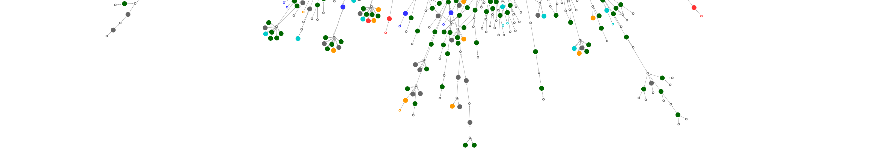

## Hi, my name is Carissa! 👋
I am a data science and computational biology researcher. 

- 🔭 I’m currently working on the EU horizons project [ADAPT](https://adapt.univie.ac.at/) at [NIB-SI](https://github.com/NIB-SI). 
- 😄 Pronouns: [she](https://www.mypronouns.org/she-her) 

---

### 
Find me online 

